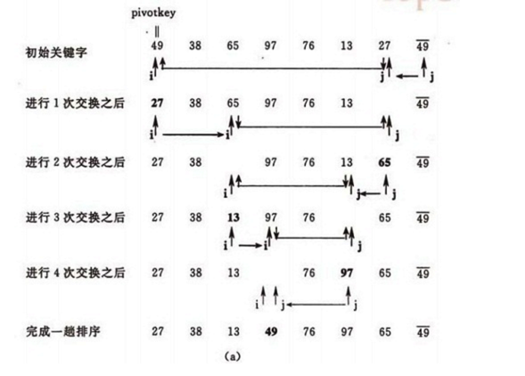

各种排序规则
====

### 1.冒泡排序

基本思想：

两两比较待排序数据元素的大小，发现两个数据元素的次序相反（大的在前，小的在后）时即进行交换，每一次扫描会把扫描区间最大的数字放在尾部。

位置：com.algorithm.bubbling.BubblingSort

### 2. 快速排序

基本思想：

选择最左边的一个元素作为基准元素，然后分别从两头开始与基准元素比较大小，最后形成以基准元素为分隔点，左边是较小的元素，右边是较大的元素。然后同样道理分别对左侧、右侧的子列表递归排序。

位置：com.algorithm.quick.QuickSort

### 3. 